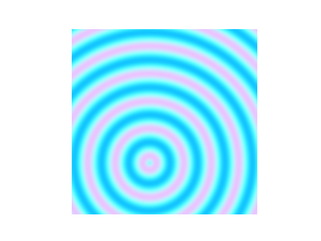
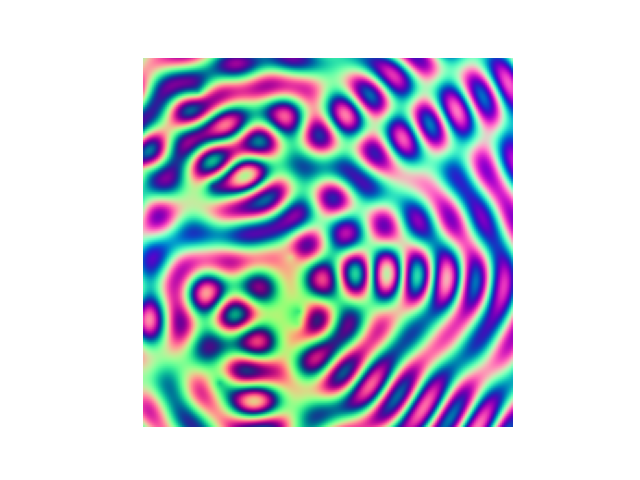
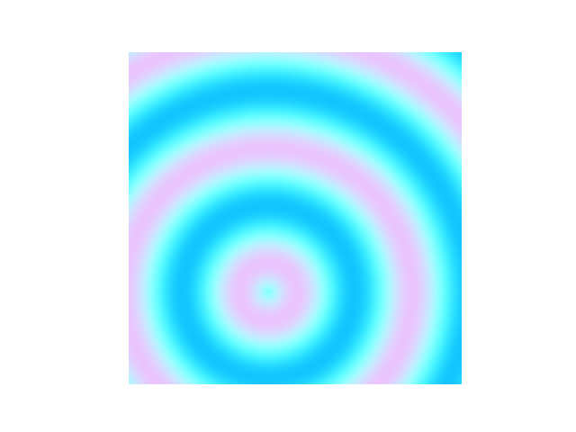
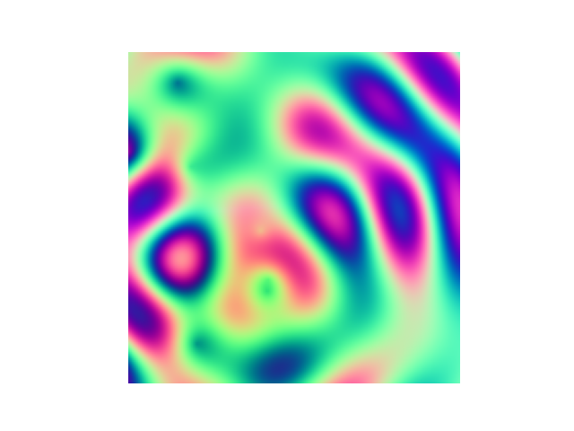

# Assignment 1: NumPy Array Manipulation for 2D Pattern Generation

[View on GitHub]({{ site.github.repository_url }})

## Table of Contents

- [Objective](#Objective)
- [Pseudo-Code](#pseudo-code)
- [Technical Explanation](#technical-explanation)
- [Results](#results)

## Objective

The goal of this assignment is to create a Python program using NumPy to manipulate a 2-dimensional array and transform a blank canvas into a patterned image. You are asked apply various array operations, introduce randomness, and work with RGB channels to produce full-color images.

## Pseudo-Code

1. **Initialize Variables**
   - Set canvas dimensions (height and width).
   - Define color values.
   - Set number of attractor points

2. **Create Blank Canvas**
   - Initialize a 2D NumPy array filled with zeros.

3. **Generate Attractor Points**
    -  Generate random attractor points within canvas dimensions

4. **Define Distance Function**
    - Compute euclidian distance to attractor point

5. **Generate Pattern**
    - **For** each pixel in canvas_
        - Compute distance to attractor points
        - Apply sine to distances
        - Sum sine values
        - Map normalized values to RGB channels
        - Store values in canvas

6. **Visualize Canvas as Image**
    - matplotlib.pyplot as plt

## Technical Explanation

Python with NumPy is used to generate sinus wave functions with interference. The NumPy Array named canvas stores values for each pixel. np.random.random creates a set number of random attractor points. The function "distance()" computes the Euclidean distance between a pixel and a attractor point. All canvas pixels are looped through and the distance to attractor points is computed. The sine values derived from the distance functions are summed. To visualize the interference pattern, the summed interference value is mapped to the red and green RGB color channels. The blue channel is derived from normalized distance values. r g and b values are stored in canvas and visualized via matplotlib.pyplot.

## Results

|Number of Attractor Points|Frequency Parameter|Seed|
|----|----|----|
|1|1.5|1|

|Number of Attractor Points|Frequency Parameter|Seed|
|----|----|----|
|7|1.5|1|

|Number of Attractor Points|Frequency Parameter|Seed|
|----|----|----|
|1|3.5|1|

|Number of Attractor Points|Frequency Parameter|Seed|
|----|----|----|
|7|3.5|1|

---
