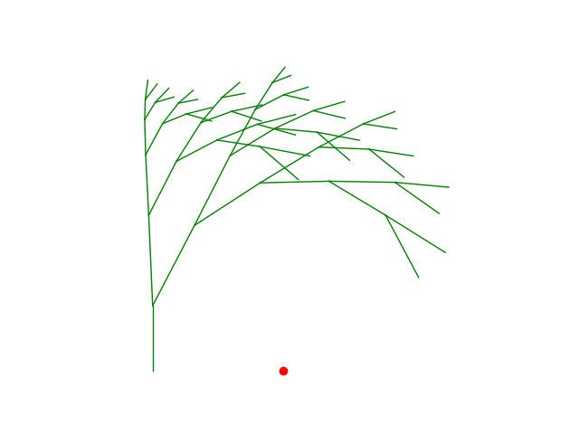
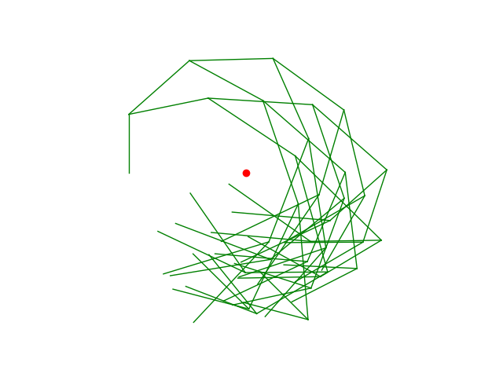
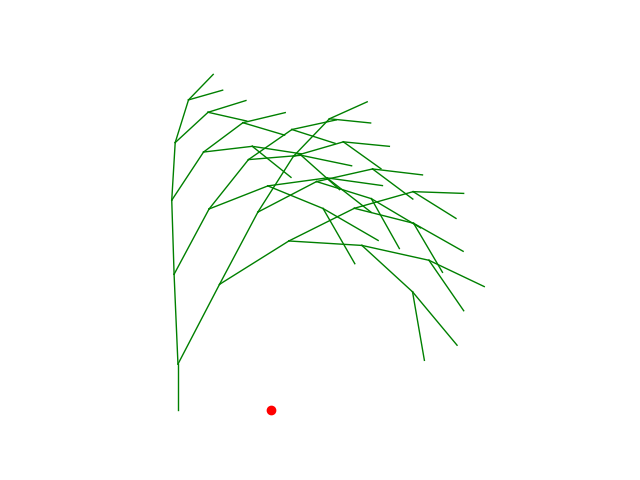
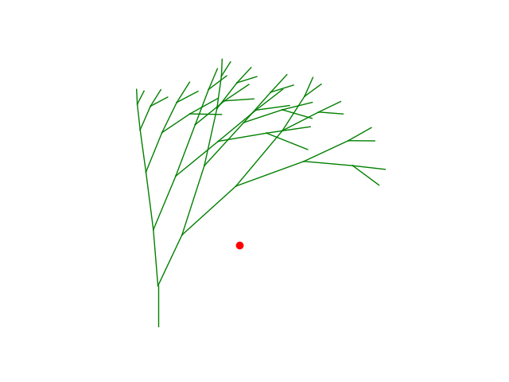
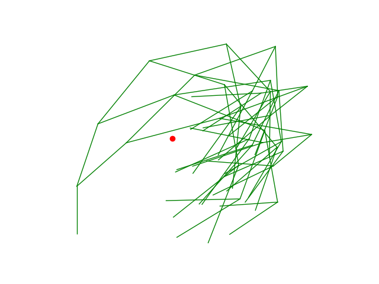
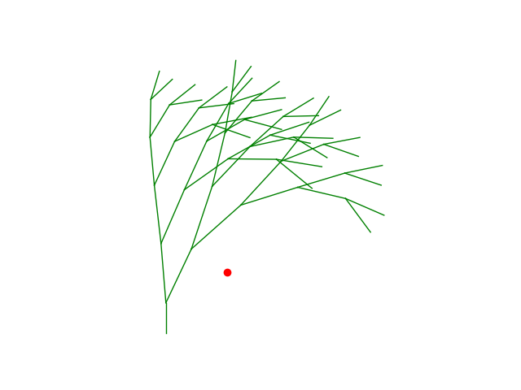
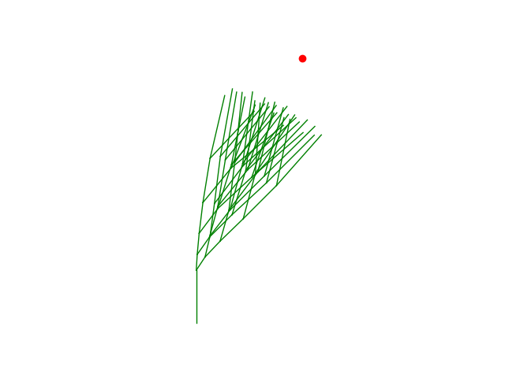
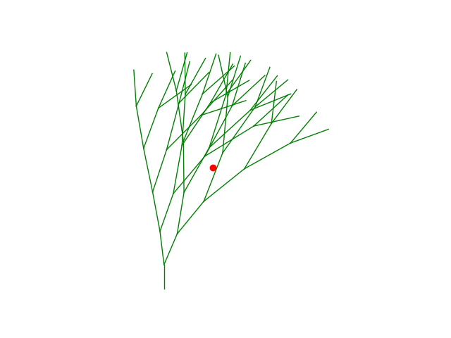

# Assignment 2: Exploring Fractals through Recursive Geometric Patterns

[View on GitHub]({{ site.github.repository_url }})

## Table of Contents

- [Objective](#Objective)
- [Pseudo-Code](#pseudo-code)
- [Technical Explanation](#technical-explanation)
- [Geometric Influences](#Geometric-influences)
- [Results](#results)
- [References](#references)

## Objective

In this assignment you will implement a **recursive generator** and enrich it with **geometric influences** that shape how the structure grows in space. You will work with geometric primitives (lines, polylines) using **Shapely** and render the results (e.g., with Matplotlib). The core of the assignment is to **couple formal grammar growth with spatial rules** such as attractor/repulsor points, fields, and collision constraints to produce expressive, controllable patterns.

While the branching or growth approach can be inspired by L-systems, it does not have to be strictly L-system based. You are encouraged to explore recursive generation methods influenced by spatial constraints and geometric rules that govern how the fractal develops and interacts with its environment. This opens opportunities to experiment with recursive branching logic, adaptive scaling, and spatial modulation beyond formal grammar rewriting.

## Pseudo-Code

1. **Initialize Variables**
    - Set number of generations
    - Initial branch angle
    - Maximum and minimum branch lengths and a length factor to control branch length behavior dependant on proximity to attractor point.
    - Attractor point coordinates
    - An attraction factor for controlling attraction strength to a point
    - Starting point and direction (A, V)
    - Empty list containing branch geometries via shapely

2. **Function Rotate Vector**
    - Rotates a given vector by angle input

3. **Function Normalize**
    - returns a unit vector

4. **Function LengthField**
    - Computes distance and from point to attractor point for controling branch length based on attractor point proximity
    - a minimum length is guarenteed to avoid length = 0

5. **Function Grow()**
    - if gen is less than defined max number of generations, run function
    - Compute vector from point to attractor point, add to direction vector and normalize to influence growth direction towards attractor point
    - LengthField function computes branch length based on proximity to attractor point
    - Compute two branch directions from initial input angle and the geometric influences
    - Compute branch endpoints from geometric influences
    - Grow(endpoint1, direction1, gen + 1)
    - Grow(endpoint2, direction2, gen + 1)

6. **Add initial branch to Lines**
    - A in direction V

7. **Call Grow(starting point, V, gen = 0)**

8. **Visualize**
    - Draw lines
    - Draw Attractor point

## Technical Explaination

Python and shapely is used to create a recursive branching structure. Branch lengths and branch directions are influenced by spatial context. From a starting point, two branches are recursively generated until a set number of recursion depth is reached. At each step, branch direction is influenced by proximity to an attractor point and a universel set starting angle. The directional bias is computed from a vector pointing from branch endpoint towards the attractor point and the attraction force is scaled by a user defined attractor point factor. Branch length is controlled by distance to the attractor point and a user defined falloff factor. The resulting line segments are stored and used as a basis for subsequent recursive calls.

## Geometric Influences
Branch geometry is influenced by an attractor point that pulls branch direction based on a strength factor and a distance based field that controls branch length.

## Results

|Number of Generations|Initial Angle|Length Factor|Attractor Point Coords|Attractor Strength|
|----|----|----|----|----|
|5|15 degrees|0.5|(2,0)|0.1|

|Number of Generations|Initial Angle|Length Factor|Attractor Point Coords|Attractor Strength|
|----|----|----|----|----|
|5|15 degrees|0.5|(2,0)|0.5|

|Number of Generations|Initial Angle|Length Factor|Attractor Point Coords|Attractor Strength|
|----|----|----|----|----|
|5|15 degrees|0.25|(2,0)|0.1|

|Number of Generations|Initial Angle|Length Factor|Attractor Point Coords|Attractor Strength|
|----|----|----|----|----|
|5|15 degrees|0.5|(2,2)|0.1|

|Number of Generations|Initial Angle|Length Factor|Attractor Point Coords|Attractor Strength|
|----|----|----|----|----|
|5|15 degrees|0.5|(2,2)|0.5|

|Number of Generations|Initial Angle|Length Factor|Attractor Point Coords|Attractor Strength|
|----|----|----|----|----|
|5|15 degrees|0.5|(2,2)|0.5|

|Number of Generations|Initial Angle|Length Factor|Attractor Point Coords|Attractor Strength|
|----|----|----|----|----|
|5|15 degrees|0.5|(2,5)|0.1|

|Number of Generations|Initial Angle|Length Factor|Attractor Point Coords|Attractor Strength|
|----|----|----|----|----|
|5|15 degrees|0.5|(2,5)|0.5|

|Number of Generations|Initial Angle|Length Factor|Attractor Point Coords|Attractor Strength|
|----|----|----|----|----|
|5|15 degrees|0.25|(2,5)|0.1|

## References

Video on recursive brancing structure

https://www.youtube.com/watch?v=wV6W69b-l7w

### ChatGPT
Normalizing vectors for smoother directional bias 
Resolving issues with incompatible list structures
