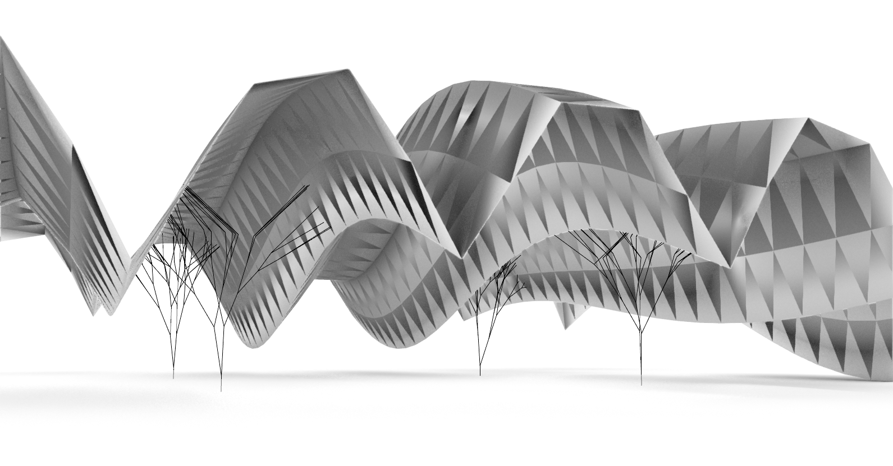
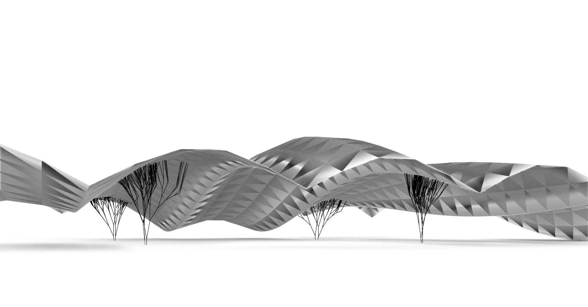
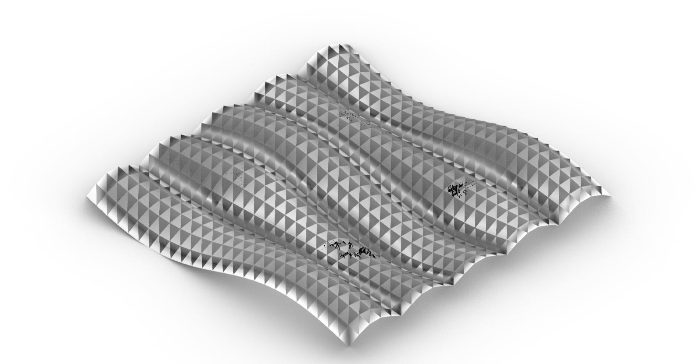
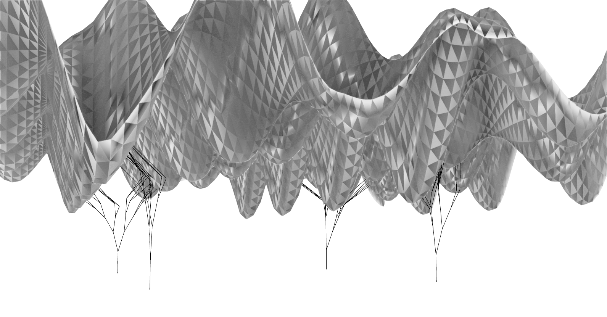
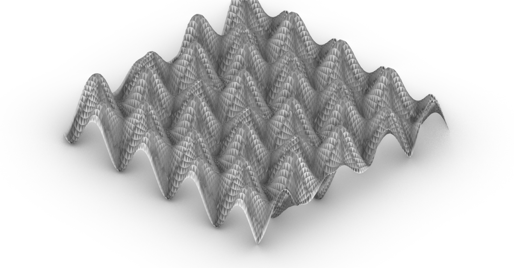

# Assignment 3: Parametric Structural Canopy

[View on GitHub]({{ site.github.repository_url }})

## Table of Contents

- [Pseudo-Code](#pseudo-code)
- [Technical Explanation](#technical-explanation)
- [Design Variations](#design-variations)
- [References and AI Acknowledgments](#references-and-ai-acknowledgments)

## Pseudo-Code

1. **Initialize Variables**
    - Passed in via grasshopper inputs

2. **Define Functions**

    - **Function boundingbox_anchor_pts(mesh)**
        - rs.BoundingBox(mesh) to get 4 appropriate anchorpoints
        - loop through each anchor point, average coordinates to get a center point
        - rg.Transform.Rotation(angle, center point) rotates anchorpoints around center point
    returns anchor points

`heightmap(U, V, amplitude, frequency, phase)`
    np.sin wave in U direction
    np.cos wave in V direction

    addition of simple np.sin ridges parallel to V
returns height values in numpy array shaped as U,V

`make_point_grid_xy(divU, divV, origin, size)`
    1/(divU divV) normalized distance between points

    loops through normalized spacing, multiply by grid size to get real x, y coordinates
returns grid of points

`move_along_z(grid of points)`
    loops through each point 
        add heightmap value to z coordinate
returns moved grid of points

`surface_from_point_grid(moved grid of points)`
    loops through moved grid of points
        flatten data structure
    retruns flattened list of points

    rs.AddSrfPtGrid(data structure information ,flattened list of points) generates a surface from moved grid of points
returns surface

`sample_uniform_grid(surface, U, V)`
    rs.SurfaceDomain obtains start and end domains in U and V direction
    i/(U and V) for U and V + 1 produces evenly spaced U and V parameters
        returns lists of evenly spaved U and V parameters
    
    loops through U and V parameter
        rs.EvaluateSurface returns 3d points for the given U and V coordinate
returns grid of surface points

`tri_mesh_from_points(grid of surface points)`
    vertices = [pts[i][j] for i in range(rows) for j in range (cols)] devolves datastructure into a 1d list
    for each quad cell in grid of surface points
        a = i * vcols + j
        b = a + 1
        c = b + vcols
        d = c - 1

        creates two triangle cells via
            faces.append([a, b, c])
            faces.append([a, d, c])
    rs.AddMesh constructs a mesh from the list of vertices and the triangular faces
returns mesh

`Grow(starting point, starting direction, length, number of generations)`
    rs.PlaneFromNormal to generate a plane with current direction as the normal
    rs.EvaluatePlane generates a random point on plane for rotation
    rs.VectorCreate creates the current rotation axis
    rs.MeshClosestPoint locates closest point on mesh from branch
        at last gen - generates branch from endpoint to mesh

    for A in a_pts:
        B = rs.PointAdd(A, rs.VectorScale(V, L))
        Lines.append(rs.AddLine(A, B))
        Grow(B, V, L, 0)
    loop through each anchor point
returns list of lines

## Technical Explanation

The structural canopy is based on a heightmap generated from simple sine and cosine wave functions combined with custom ridges along U direction. The Canopy is controlled with amplitude, frequency and phase inputs. Randomness is introduced with different weighted wave and ridge values for each heightmap generation.

To create the tesselation of the structural canopy, the surface obtained from the heightmap is reparameterized and uniformly partitioned into a grid of points, each cell is divided into two triagular faces and a triangular mesh is made.

The structural branches are recursively generated from anchor points. Each iteration randomly rotates the current branch in 3d space. Last interation finds closest point on the canopy mesh and snaps onto it.

## Design Variation

### Design A
|dU|dV|amp|frq|pha|orix|oriy|oriz|sizex|sizey|anchor_rot_angle|anchor_scale|gen|angle|L|seed|U1|V1|
|----|----|----|----|----|----|----|----|----|----|----|----|----|----|----|----|----|----|
|50|50|3|1|0.25|0|0|1|10|10|0|0.42|5|10|0.42|8|25|25|

### Design B
|dU|dV|amp|frq|pha|orix|oriy|oriz|sizex|sizey|anchor_rot_angle|anchor_scale|gen|angle|L|seed|U1|V1|
|----|----|----|----|----|----|----|----|----|----|----|----|----|----|----|----|----|----|
|50|50|1|1|0.25|0|0|1|10|10|0|0.42|7|0.27|25|17|25|25|

### Design C
|dU|dV|amp|frq|pha|orix|oriy|oriz|sizex|sizey|anchor_rot_angle|anchor_scale|gen|angle|L|seed|U1|V1|
|----|----|----|----|----|----|----|----|----|----|----|----|----|----|----|----|----|----|
|50|50|2|4|0.36|0|0|2|10|10|0|0.42|4|0.4|25|17|100|100|

## References and AI Acknowledgments
Branching structure youtube video
https://www.youtube.com/watch?v=wV6W69b-l7w&t=1345s
